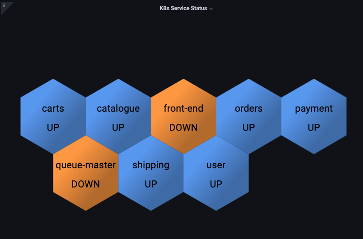
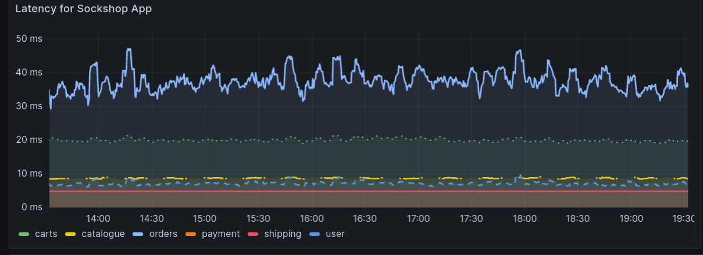

# Solo Makeover
We will be revamping the following dashboard.

Go to the magnifying glass icon in the left menu and search for "Dull".  Choose the Dull Dashboard.

*This dashboard does have useful information as it contains RED metrics - request rates, errors, and duration/latency - for our service; and it contains state information for the underlying pods as well as end-user activity from a geographic lens.  Our aim is to make the information on the dashboard easier to understand and more visually appealing.*

## Convert the Error Rates panel from a deprecated "graph" panel to a Stat Panel
We will edit the Error Rates panel first.  We want to add context to what error rates are acceptable, in a danger zone, or are in violation of an internal Service Level Objective (SLO).

1. Edit the *Error Rates* panel (click on the panel's title and then *Edit*)
2. Switch the Visualization Type from *Graph (Old)* to *Stat*
3. Under *Stat styles*:
* Change Orientation from Auto to Horizontal.
* Change Color Mode from Value to Background.
4. Click *Add value mappings*
* Click *Add a New Mapping* and then *Range*. Set range from 0 to 1 with Display Text of *OK*. Set color to Blue.
* Click *Add a New Mapping* and then *Range*. Set range from 1 to 2 with Display Text of *Service Degraded*. Set color to Yellow.
* Click *Add a New Mapping* and then *Range*. Set range from 2 to 100 with Display Text of *SLO Violation*. Set color to Orange.
* Click on Update
The value mapping settings should look like this:

5.  Change the Panel Title to *SLO Status (Errors) per Data Center*
6.  Click on *Apply*
## Convert the K8s Service Status panel from a table to a Polystat Panel
This table is showing us tons of information that we already know.  The original goal of this table was to show a state of 1 (UP) or 0 (DOWN) for each of our service containers.   Our new goal is to simplify the presentation of the information using a *polystat* panel.  
1. Edit the *K8s Service Status* panel (click on the panel's title and then *Edit*)
2. Switch the Visualization Type from *Table* to *Polystat*
* You will notice that all of the rows have been aggregated into one average of all values.  To separate our data per container, change the formula's *Format* from Table to Time Series.
3. Under Options...Global, change Decimals from 2 to 0 as the *Instant* value will always be a 0 or 1.
4. Change the Polygon Border Color to Transparent.
5. Under Thresholds, click on *Add Threshold*.  
* For T1, leave value of 0, but change Color Mode from *ok* to *critical*.  Change the Color from Red to Orange.
* For T2, set value to 1 for Color Mode *ok*.  Change the Color from Green to Blue.
7. At the bottom, click on *Add a value mapping*. 
* set value of 1 to *UP*.
* add a 2nd value mapping with 0 set to *DOWN*.
Click apply.  The panel should look similar to what we have below.


## Convert the Customer Activity panel from a stat panel to a Geomap
This one is a mess. I've been told that this data is from OSS Loki, our logging tool, and represents the number of hits coming from each Geographic region. It is colorful, but I have a very difficult time interpreting the information.  Let's change the visualization to a map!
1. Edit the *Customer Activity* panel (click on the panel's title and then *Edit*)
2. Switch the Visualization Type from *Stat* to *Geomap*
3. Under *Base Layer*, change the Layer type to *Open Street Map*
4. CRITICAL! Since this is a point-in-time view, change the *Query Type* of your formula from Range to __Instant__.
5. Scroll up to *Data layer* and click on Layer 1, *markers*.  For your markers on the map, you want to do a lookup of the country by geoip_country_code. To do this, under *Location*, click *Lookup* and then choose Lookup Field, geoip_country_code.  You should now see data on your map. But we're not done!
6. Under Styles...Size, Change from *Fixed Value* to *geohits*.
7. Change Symbol from Circles to Cross.
8. Change color from Fixed to *value #geohits*.
9. Go to Thresholds and set the color of the Base to Orange; for a threshold of 10, set the color to Yellow; add a 3rd threshold of 20, setting the color to Blue.
## Update the Latency for Sockshop App panel from an old "graph" panel to a Time Series Panel
Since this service latency graph is viewed by dozens of people, we know statistically that at least 2 people viewing this graph are colorblind.  That said, the Product owner of Sockshop called the colors 'uninspiring'.  You also notice that the legend is rough around the edges.

1. Edit the *Latency for Sockshop App* panel (click on the panel's title and then *Edit*)
2. Switch the Visualization Type from *Graph (Old)* to *Time Series*
3. Let's fix the legend first.  
* In the legend field, enter {{ job }}.  You will notice that the name of the job is displayed instead of the raw key/value pair.  But we still don't like the fact that the namespace of _development_ still appears.  So, let's use a _transformation_ to rename our fields.
* Click on _Transform_ and then _Rename by Regex_.  For match, let's do 2 string captures - before and after the */*. 
* For match, type in *(.+)\/(.+)*
* In this case, we just want to use the 2nd capture group, and so for the _Replace_ field, type in *$2*
4. Someone else said this graph, denoted in seconds, would be easier to understand if it were in milliseconds.  
* Let's change the formula by adding ** 1000* to the end of the formula.
* Add a unit to the y-axis.  Under the panel's search options (top right), type in _Unit_.  For the unit, use _Time / Milliseconds (ms)_.
5. We now want to make it easier for our colorblind
* For all lines, under *Graph Styles*, choose a Line Width of 2 and a Fill opacity of 0
* Let's make dataset _user_ a dotted line.  In the upper right, click on *Overrides* and _Add field override_. 
* Choose fields with name _carts_ and Add override property.  In search, find _Graph styles > Line style_. Change from Solid to *Dots*.
* Let's make dataset _catalogue_ a dashed line. Add an override for Fields with name _catalogue_, adding a Line Style override. For the dash pattern, we want to see short-long-short, and so to do this, we choose *30,3,3* in the dropdown.
* We will make fields _user_ and _payment_ dashed lines as well. For _user_, first add an override for line width, setting it to 1.  Then, use a *10,10* dash line style.  For _payment_, use a *5,10* dash line style.
* We will keep orders as-is.
Below is what your panel should look like:


## Convert the Server Request Rates panel from an old "graph" panel to a Stat Panel
Like our first panel, we want context to understand what good looks like.  Knowing our internal data patterns, we want to avoid service overload conditions where end-user performance can be affected.  
1. Edit the *Server Request Rates* panel (click on the panel's title and then *Edit*)
2. Switch the Visualization Type from *Graph (Old)* to *Bar Gauge*
3. Under *Bar Gauge*:
* Change Orientation from Auto to Horizontal.
* Change Display Mode from *Gradient* to *Retro LCD*
4. Under Thresholds:
* Change the base color from Green to Blue
* Change the 2nd color from Red to Yellow
* Add a third threshold level, 90.  Set color to Orange.
Below is what your panel should look like:


Add our company logo
Finally we'd like to add our company logo.  To do so, add a *Text* panel.
For _mode_ in the bottom right, choose HTML.
Remove the default text and paste in the following HTML:
```<center></center>```
Remove the Panel Title and click Apply.  Size the panel appropriately.
