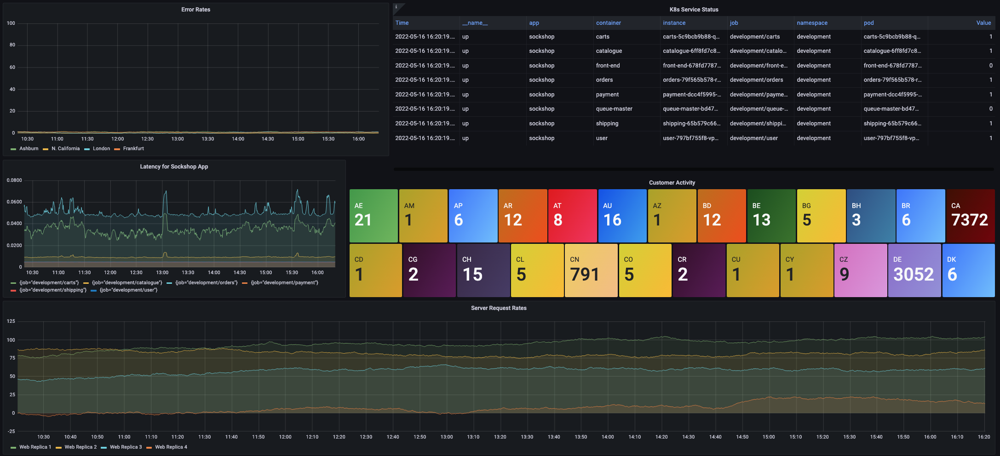

# Solo Makeover
We will be revamping the following dashboard.

Go to the magnifying glass icon in the left menu and search for "Dull".  Choose the Dull Dashboard.

*This dashboard does have useful information as it contains RED metrics - request rates, errors, and duration/latency - for our service; and it contains state information for the underlying pods as well as end-user activity from a geographic lens.  Our aim is to make the information on the dashboard easier to understand and more visually appealing.*

## Convert the Error Rates panel from an old "graph" panel to a Stat Panel
We will edit the Error Rates panel first.  We want to add context to what error rates are acceptable, in a danger zone, or are in violation of an internal Service Level Objective (SLO).

1. Edit the *Error Rates* panel (click on the panel's title and then *Edit*)
2. Switch the Visualization Type from *Graph (Old)* to *Stat*
3. Under *Stat styles*:
* Change Orientation from Auto to Horizontal.
* Change Color Mode from Value to Background.
4. Click *Add value mappings*
* Click *Add a New Mapping* and then *Range*. Set range from 0 to 1 with Display Text of *OK*. Set color to Blue.
* Click *Add a New Mapping* and then *Range*. Set range from 1 to 2 with Display Text of *Service Degraded*. Set color to Yellow.
* Click *Add a New Mapping* and then *Range*. Set range from 2 to 100 with Display Text of *SLO Violation*. Set color to Orange.
* Click on Update
The value mapping settings should look like this:

5.  Change the Panel Title to *SLO Status (Errors) per Data Center*
6.  Click on *Apply*

## Convert the Server Request Rates panel from an old "graph" panel to a Stat Panel
Like our first panel, we want context to understand what good looks like.  Knowing our internal data patterns, we want to avoid service overload conditions where end-user performance can be affected.  
1. Edit the *Server Request Rates* panel (click on the panel's title and then *Edit*)
2. Switch the Visualization Type from *Graph (Old)* to *Bar Gauge*
3. Under *Bar Gauge*:
* Change Orientation from Auto to Horizontal.
* Change Display Mode from *Gradient* to *Retro LCD*
4. Under Thresholds:
* Change the base color from Green to Blue
* Change the 2nd color from Red to Yellow
* Add a third threshold level, 90.  Set color to Orange.

